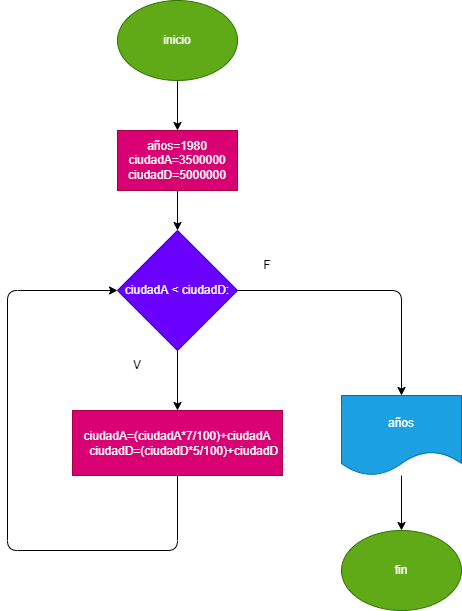

# ciudades-y-ratas

# En 1980 la ciudad A tenia 3.5 millones de abitantes y una rata de crecimientro del 7% anual; y la ciudad D tenia 5 mllones y una rata de crecimiento de 5% anual si el crecimiento poblacional se mantiene constante en las dos ciudades, hacer el diagrama de flujo y el programa en phyton que calcule e imprima en que año la poblacion de la ciudad A es mayor que el de la ciudad D

# # Diagrama de flujo:
